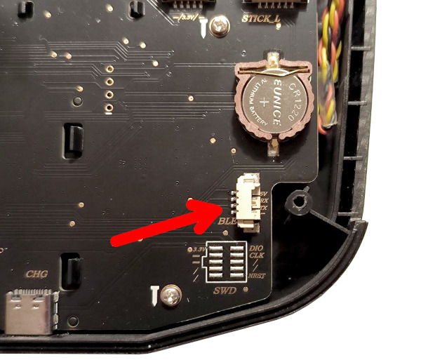
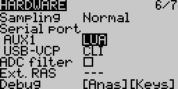
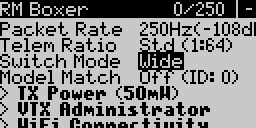
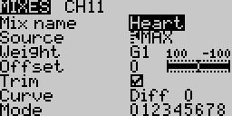
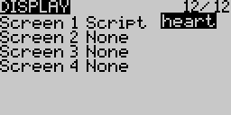
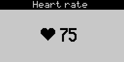
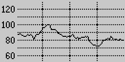

# Heart Rate Monitor for FPV drones

Watch your heart rate on Betaflight OSD ❤️📈

<p align="center">
  
[](https://youtu.be/yA9xkAsMA1U)  [](https://youtu.be/_b7GmlouoaM)  

</p>

<p align="left">  

</p>

### 1. HR Monitor
Get any Bluetooth chest strap heart rate monitor (for example, Kalenji ZT26D, Magene H64, Coospo H6).<br>
Chest monitors are recommended. They are much more precise than wrist monitors.

### 2. ESP32 Firmware

1. Download firmware [source code](ESP32).
2. Configure parameters in `config.h` for your target board.
3. Select `Board: ESP32C3 Dev Module`, and `CPU Frequency: 80 MHz (WiFi)` in `Tools` menu.
4. Upload firmware to ESP32.

[How to install ESP32 in Arduino IDE](https://randomnerdtutorials.com/installing-esp32-arduino-ide-2-0/)

### 3. Bind procedure

| LED state  | Status |
| :--------: | :-----------: |
| Slow blink | No devices    |
| Fast blink | Device found     |
| Solid      | Device connected |
| Off        | Sleep     |

1. Power up ESP32 module.
2. Power up your heart rate monitor.
3. Wait until LED is blinking fast.
4. Hold BOOT key for 1 second and release. 
5. Wait until LED is solid.<br>
Now your HR monitor is bound to ESP32 module.<br>
If no devices connected in 1 minute, module enters sleep mode.

### 4. Connection
Wire up ESP32 module to your Radio transmitter as depicted below:
<p align="center">


</p>

### 5. EdgeTX
1. Configure AUX port for `LUA` in `Hardware` tab.

<p align="center">

</p>

2. Set `Switch Mode` to `Wide` in ExpressLRS script.

<p align="center">

</p>

3. Configure any aux channel (from CH6 to CH12) as following:<br>
`Source: MAX`<br>
`Weight: GV1`

<p align="center">

</p>

4. Copy [`heart.lua`](/Lua/) and [`heart.bmp`](/Lua/) to `SCRIPTS/TELEMETRY` directory on SD card.<br>
5. Enable `heart` script on `Display` page.

<p align="center">

</p>

6. Return to main screen and long press `TELE` key.
<p align="center">
 
</p>

7. Switch between 2 screens with a scroll wheel.<br>

### 5. Betaflight

1) Betaflight ≥4.4 is required.

2) Enable `Aux value` element on OSD tab in Betaflight Configurator.

3) Enter the following lines in CLI:
```
set osd_aux_symbol = 121
set osd_aux_channel = 7
save
```

Where `7` is the channel number in EdgeTX mixer minus 4.<br>
For example: 5 for CH9, 6 for CH10, 7 for CH11, etc.

4) **Analog**: Upload [font](/Fonts/mcm) with additional heart symbol in `Font Manager` on OSD tab in Betaflight Configurator.
  
   **HDZero**: Put [font](/Fonts/HDZero) file with heart symbol to your goggles' SD card at `resource/OSD/FC/`. <br>
   Rename file to `BTFL_000.bmp`.
   [More info](https://github.com/hd-zero/hdzero-osd-font-library/)

Done! 
<br>
<br>

### Future plans
* Lua scripts for TX16 color screen 480x272.

Feel free to contact me in Telegram: [@AlexeyStn](https://t.me/AlexeyStn)


