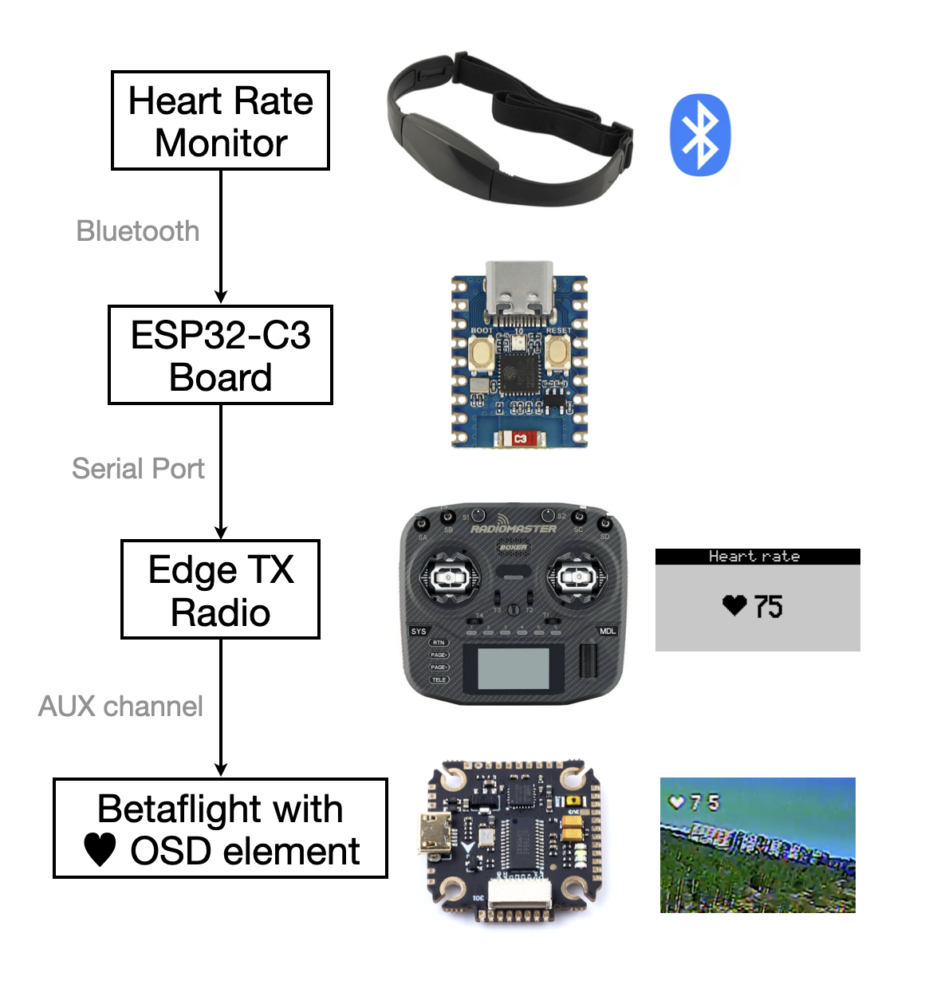

# Heart Rate Monitor for FPV drones

Watch your heart rate on Betaflight OSD 💓

<p align="center">

</p>

See how excited you are while:<br>
* Diving the highest skyscraper 🏙 <br>
* Flying long-range over the mountains 🏔 <br>
* Racing in the championship finals 🏁

Get a realtime bio-feedback to improve your flight stability.<br> 
Practice to control your stress level 🧘‍♂

Demo flights video:

<p align="center">
  
[](https://youtu.be/yA9xkAsMA1U)  [](https://youtu.be/_b7GmlouoaM)  

</p>

### 1. HR Monitor
Get any available chest strap heart rate monitor with Bluetooth.<br>
Chest strap monitors are recommended.<br>
They are widely used by athletes, because they provide higher precision, not affected by body movements. Although, you may use wrist-strap monitor.

### 2. ESP32
Upload [firmware](ESP32/ESP32_BLE_HRM_Client) to ESP32 board. [How to install ESP32 in Arduino IDE](https://randomnerdtutorials.com/installing-the-esp32-board-in-arduino-ide-windows-instructions/)

Put on your heart rate monitor and open `Serial Monitor` in Arduino IDE to check if the firmware works correctly and ESP32 module discovers your HR monitor.<br>

Wire up ESP32 module to your Radio transmitter as depicted below:
<p align="center">

</p>
You can use external 5V source (such as power-bank) or connect it to available 5V transmitter outputs (e.g. pins in JR module bay, Radiomaster TX16S bottom connector, etc.).

Trainer port uses 3.5mm 3-pin jack connector.

**For advanced enthusiasts:**<br>
You can wire it up directly to the main board of your radio. Pads are not labeled usually, so be very careful!! <br>
Here is an example, how I did it for my Taranis Q X7 board:
<p align="center">

</p>

### 3. OpenTX
1. Configure Trainer port as `Master/Jack`. Go to `Trainer` page to make sure if some variable signal is coming (bottom line).

<p align="center">
 
</p>

2. Go to `Mixer` page. Set one of your channels source to `TR1`. Now you are redirecting heart rate to RX.

<p align="center">

</p>

3. (Optional) Copy [`heart.lua`](/Lua/) and [`heart.bmp`](/Lua/) to `SCRIPTS/TELEMETRY` folder on SD card.<br>
Enable it on `Display` page.

<p align="center">

</p>

Now you are able to watch current heart rate and the latest statistics plot on the radio display. 

<p align="center">
 
</p>

Switch between them with a scroll wheel.<br>
Only 128x64 displays are supported so far.

### 4. Betaflight

1) Flash your FC with the modified version of Betaflight 4.2.9 with additional OSD element. ([Source code](https://github.com/alexeystn/betaflight/tree/alexeystn_heartrate))

<p align="center">

</p>

* Download [HEX firmware](/Betaflight) for your target chip. There are HEX files for unified targets (F405, F722), so you need to apply defaults for your particular FC later. 
* Open Betaflight configurator, `Firmware Flasher` tab.
* Select your board name in the list (OMNIBUSF4SD, MATEKF405, FOXEERF722V2 etc.)
* Press `Load firmware [Local]` and select downloaded HEX-file (filename)
* Press `Flash Firmware` and wait until it is done.
* When FC is flashed, press `Connect`. You will see a following window. Press `Apply custom defaults`.

<p align="center">

<p>

2) Restore all your previous Betaflight settings.

3) Upload you favourite [font](/Fonts/mcm) with additional heart symbol in `Font Manager` on OSD tab.

4) Enable new element on OSD. It is displayed as `Unknown` in configurator now.

<p align="center">

</p>

5) Go to CLI and enter the following: 
```
set osd_heart_rate_channel = 8
save
```

Where `8` is the channel you configured in OpenTX mixer.

Done! 
<br>
<br>

### Future plans
* Tests with many different HRM models.
* Lua scripts for bigger screens (212x64, 480x272).
* PR to official Betaflight repository.


Feel free to contact me in Telegram: [@AlexeyStn](https://t.me/AlexeyStn)


